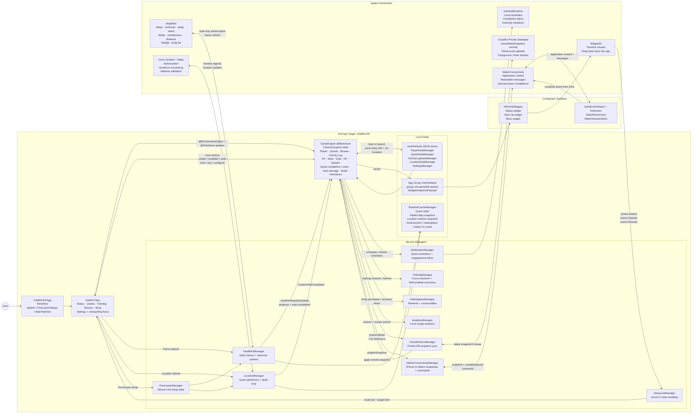

# PRAXIS

PRAXIS is an iOS-first behavior engine that turns real-world execution into RPG progression.

You do the work. PRAXIS closes the feedback loop instantly with quests, XP, Gold, boss damage, and visible character growth.

> Internal Xcode target names remain `GAMELIFE` for project continuity. User-facing product name is **PRAXIS**.

## TL;DR

- iOS productivity app with RPG systems (quests, bosses, stats, leveling, economy)
- Auto-tracking via HealthKit and Location
- Dynamic Bosses that react to real metric progress (weight, body fat, savings, workout consistency, steps, sleep, hydration, mindfulness, distance)
- In-app language switching with German, Russian, French, Italian, and Spanish support
- Home Screen widgets for status, next-up quests, and boss progress
- CloudKit sync, watchOS companion, onboarding, achievements, and configurable death/streak mechanics

## Product Thesis

Most productivity tools are informational. PRAXIS is motivational infrastructure.

Real life fails on three things games do exceptionally well:

1. Clear objectives
2. Immediate feedback
3. Meaningful stakes

PRAXIS implements all three so discipline feels like progression, not friction.

## Core Loops

### 1) Quest Loop

- Tracking types: `manual`, `healthKit`, `location`, `timer`
- Cadence: hourly, daily, semi-weekly, weekly, monthly
- Optional quests:
  - grant XP and stat growth
  - grant no Gold
  - do not apply missed-quest HP damage
- Metric quests support incremental progress bars and diagnostics
- Reminders and completion flows are integrated

### 2) Boss Loop

- Standard bosses: fixed HP, quest completions deal damage
- Dynamic bosses (metric-driven):
  - weight goal
  - body fat goal
  - savings goal
  - workout consistency
  - step goal
  - sleep goal
  - hydration goal
  - mindfulness goal
  - distance goal
- Dynamic configurations can auto-generate linked quests

### 3) Training Loop

- Structured focus sessions with complete/fail outcomes
- Hooks into XP, logs, and stat progression

### 4) Risk + Recovery Loop

- HP drops for missed required behavior
- Death mechanic (toggleable penalties):
  - one-rank demotion
  - rank-scaled stat reduction
  - 20% Gold loss
  - HP reset
  - post-death report modal
- If penalties are disabled, HP still depletes

### 5) Mastery + Identity Loop

- Six attributes: `STR`, `INT`, `AGI`, `VIT`, `WIL`, `SPI`
- Trophy Room + achievements with rarity tiers and rewards
- Persistent display preferences on Status dashboard

## Integrations (Neural Links)

### HealthKit

- Auto-progress and auto-complete for eligible health/activity quests
- Per-quest sync diagnostics

### Core Location

- Apple Maps address validation
- Geofence + dwell-time tracking
- Location status and progress surfaced in quest cards

### Notifications

- Immediate or digest completion notifications
- Reminder notifications
- Smart engagement reminders learn likely return windows on-device
- Inactivity shutdown logic pauses notifications after prolonged disengagement
- Foreground iOS banners suppressed while actively using PRAXIS (in-app feedback remains)

### CloudKit

- Private DB sync across Apple devices
- No Sign in with Apple required for private CloudKit sync

### watchOS

- Watch app + extension included
- WatchConnectivity relay for snapshots and quest actions

## Feature Highlights

- Status dashboard with radar/grid stat toggle and persisted preference
- Tabbed Activity/Achievements module with persisted preference
- Next Up prioritization for high-impact quests
- GitHub-style quest completion heatmap with toggleable visibility
- Undo completion pipeline with stat/economy reconciliation
- Marketplace rewards, including health potion recovery
- Haptic system with user-configurable toggle
- Multiple app icons with in-app switching
- Configurable default launch tab and in-app language selection
- Local on-device usage analytics with export/reset controls
- Widget deep links into quests and bosses
- Guided onboarding flow for first-run activation

## Brand + Design System

Two design directions ship side-by-side:

- **System (live UI)** — the Solo Leveling-inspired "System" chrome currently on the tabs.
  Tokens in `GAMELIFE/Design/SystemTheme.swift` (Color · Typography · Spacing · Radius
  · GlowModifier · SystemCardModifier · HolographicBorderModifier).

- **Glasswork (live, in progress)** — direction 02 of the PRAXIS redesign. Frosted
  dark UI with aurora background, cyan→pink system gradient, Space Grotesk numerals,
  JetBrains Mono system voice. Lives in `GAMELIFE/Views/Glasswork/`:
    - `Views/Glasswork/Screens/` — pure-mock gallery screens used by
      `GlassworkGalleryView` (10 screens grouped by flow: Daily Loop · Combat ·
      Economy · Ceremony). Reachable from **Settings → Design Preview**.
    - `Views/Glasswork/Live/` — production screens wired to `GameEngine`. Currently:
      `GlassworkStatusView` replaces the SystemTheme Status tab. Other tabs migrate
      in subsequent versions.
    - `Views/Glasswork/BrandGuidelinesView.swift` — in-app rendering of the
      PRAXIS Brand Guidelines v1.0 (cover, palette with usage proportions, type
      stack, voice samples, Prism colorways, application rules). Reachable from
      **Settings → Design Preview → PRAXIS Brand Guidelines**.

### Prism brand assets

The PRAXIS Brand v1.0 package (`PRAXIS 2.0/`) ships into the iOS target as:

- **Prism alternate app icons — three colorways**, selectable from Settings → App Icon:
    - `AppIconPrism` — *Signal* (cyan → pink). Primary direction.
    - `AppIconPrismSolar` — *Solar* (gold → crimson). Warm alternate.
    - `AppIconPrismVerdant` — *Verdant* (mint → periwinkle). Cool alternate.

  Each set ships iOS 18 light / dark / tinted appearances generated from the
  Prism SVG geometry (see `PRAXIS 2.0/brand/prism-variants.jsx`). The Apple
  App Tint pipeline recolors the tinted asset to the user's chosen system tint.
- `Assets.xcassets/Praxis{Wordmark,Monogram}*.imageset/` — vector wordmark + P
  monogram in gradient / ink / black variants, available as `Image("PraxisWordmarkGradient")`,
  etc.
- `Design/PraxisBrandColors.swift` — `Color.px*` design tokens
  (`pxVelvet`, `pxSurface`, `pxInk`, `pxInkSoft`, `pxMute`, `pxCyan`, `pxPink`,
  `pxGold`, `pxAmber`, `pxGood`, `pxDanger`) and `LinearGradient.pxSystem`.
- `Resources/BrandTokens/` — `colors.css`, `colors.scss`, `tokens.json` for web /
  cross-platform consumers.

The HTML brand guidelines (`PRAXIS Brand Guidelines.html`, `Brand Board.html`,
`Prism Icons.html`) and their supporting JSX live in `PRAXIS 2.0/` as the canonical
reference; they are not bundled into the app.

## Architecture



### Source of Truth

`GameEngine` (`@MainActor`) owns canonical game state:

- player profile
- quests
- bosses
- activity logs
- penalties
- training sessions
- achievements

It also executes:

- XP/level/rank transitions
- stat mutations
- quest completion and undo logic
- boss damage and dynamic boss recalculation
- risk/death mechanics
- sync orchestration hooks

### Services

- `HealthKitManager`
- `LocationManager`
- `NotificationManager`
- `CloudKitSyncManager`
- `WatchConnectivityManager`
- `TrainingManager`
- `PenaltyManager`
- `MarketplaceManager`
- `HapticManager`

### Targets

- `GAMELIFE` (iOS app)
- `GAMELIFEWatch` (watch app)
- `GAMELIFEWatchExtension` (watch extension)

## Performance + Local Caching

PRAXIS keeps runtime snapshots to reduce recomputation and improve launch/resume responsiveness.

`RuntimeCacheManager` caches:

- quest ordering
- daily HealthKit snapshot
- runtime location state
- achievement progress
- marketplace catalog
- status UI state

Currently wired:

- local-first HealthKit daily loads
- daily HealthKit snapshot persistence
- location state restore on launch

## Quickstart

### Requirements

- macOS + Xcode 16+
- iOS 18+ simulator/device (iOS 26.2 simulator used in repo workflows)
- Apple Developer account for full entitlement testing

### Build

```bash
DEVELOPER_DIR=/Applications/Xcode.app/Contents/Developer \
xcodebuild -project GAMELIFE.xcodeproj \
  -scheme GAMELIFE \
  -destination 'platform=iOS Simulator,name=iPhone 17,OS=26.2' \
  build
```

### Run regression checks

```bash
bash Tests/run_regression_checks.sh
```

## Capabilities + Entitlements Checklist

### iOS target (`GAMELIFE`)

- iCloud + CloudKit
- HealthKit
- App Groups (`group.com.gamelife.shared`)
- Location permissions (`When In Use`, `Always and When In Use`)
- Health usage descriptions in `Info.plist`

## Beta / Release Readiness Notes

- **Simulator logs include framework noise** (WatchConnectivity pairing, LaunchServices, haptics, RenderBox). Validate final behavior on physical devices.
- `WCSession counterpart app not installed` is expected when watch app is not paired/installed.
- iOS notification history may show stale icon assets after icon swaps due to system caching.

## Privacy Model

- Health and location data are used strictly for quest automation.
- User game state is local-first and can sync to the user’s private CloudKit.
- App-group storage is used for app/extension communication.

## Roadmap Focus

Current beta core is stable. Near-term priorities:

1. Reliability hardening for all automation paths
2. Entitlement readiness for distribution environments
3. Metrics-driven balancing of risk/reward loops
4. Continuous UX refinement from beta feedback

---

Built for people who want execution to feel like progression.
